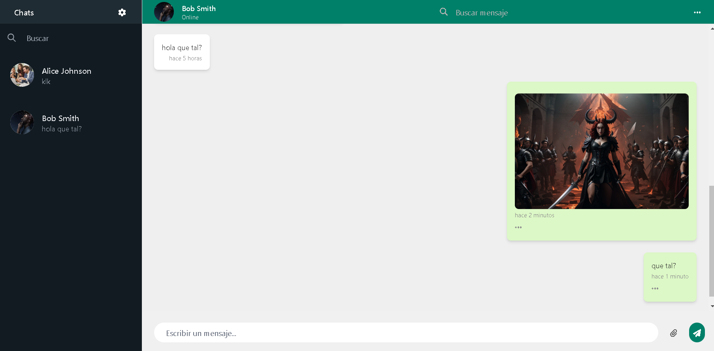

# Proyecto: Clon de WhatsApp

Este proyecto es una aplicación que simula las principales funcionalidades de WhatsApp, permitiendo a los usuarios interactuar a través de chats y otras características básicas de la plataforma. A continuación, se describen las herramientas y tecnologías utilizadas, así como las funcionalidades clave.

### Tecnologías utilizadas:

- **Backend**: Desarrollado con **.NET**, utilizando patrones de arquitectura avanzados.
  - **Entity Framework**: Para el manejo de datos y acceso a la base de datos.
  - **MediatR**: Implementación del patrón Mediator para manejar comandos y consultas de manera limpia y eficiente.
  - **Arquitectura Onion**: Estructura de capas que permite una separación clara de responsabilidades y facilita la escalabilidad y mantenibilidad del código.
  - **CORS**: Configuración de políticas de seguridad para permitir el intercambio de recursos entre diferentes dominios.

- **Frontend**: La interfaz de usuario está desarrollada con **React**, proporcionando una experiencia de usuario dinámica y rápida.

## Funcionalidades

### Inicio de Sesión
- Los usuarios pueden iniciar sesión mediante su número de teléfono. Los números de teléfono están preconfigurados en la base de datos para facilitar el proceso de autenticación.
  

### Chat
- Permite a los usuarios enviar y recibir mensajes con cualquier contacto, sin la necesidad de agregar previamente al contacto. Es suficiente con que el otro usuario haya iniciado la conversación.

